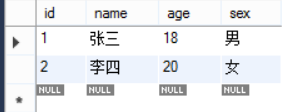
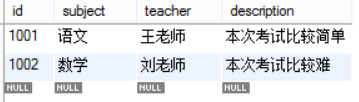
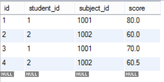

请在本地创建一个学生考试系统的数据库(student_examination_sys)，里面有三张表：

1. 学生表(student):

   |  id  | name | age  | sex  |
   | :--: | :--: | :--: | :--: |
   | 001  | 张三 |  18  |  男  |
   | 002  | 李四 |  20  |  女  |

2. 考试科目表(subject)：

   |  id  | subject | teacher |   description    |
   | :--: | :-----: | :-----: | :--------------: |
   | 1001 |  语文   | 王老师  | 本次考试比较简单 |
   | 1002 |  数学   | 刘老师  |  本次考试比较难  |

3. 成绩表(score)：

   |  id  | student_id | subject_id | score |
   | :--: | :--------: | :--------: | :---: |
   |  1   |    001     |    1001    |  80   |
   |  2   |    002     |    1002    |  60   |
   |  3   |    001     |    1001    |  70   |
   |  4   |    002     |    1002    | 60.5  |

请用SQL实现上面的需求并将实现的效果截图说明。

1. 学生表(student)：

​	创建学生表，以id为主键，向表插入两条数据，并将所有数据检索出来如图。

1. 考试科目表(subject)：

   

   创建考试科目表，以id为主键，向表插入两条数据，并将所有数据检索出来如图。

2. 成绩表(score)：

   

   创建成绩表，以id为主键，student_id为外键，关联student的id；subject_id为外键，关联subject的id，然后向表插入四条数据，并将所有数据检索出来如图。
